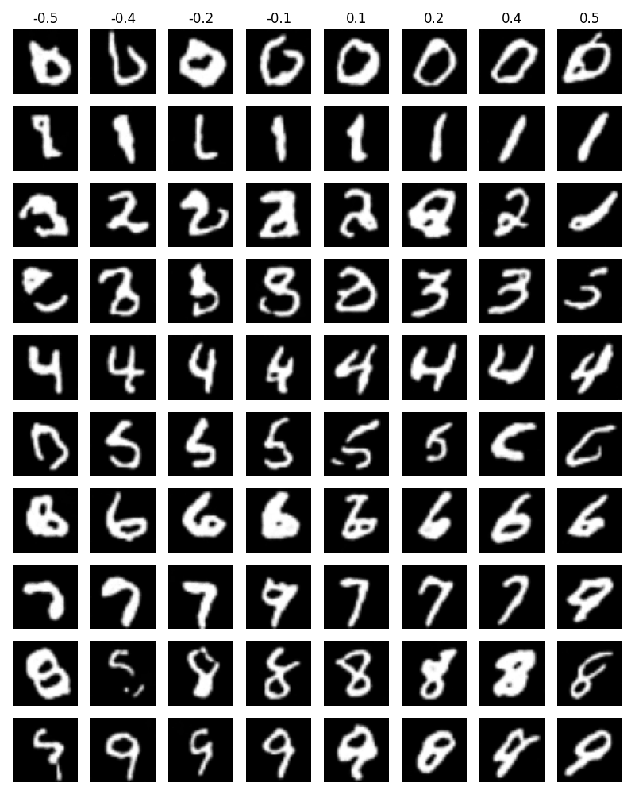

# Conditional Diffusion Transformers (DiTs) on Morpho-MNIST

This repository contains an implementation of a conditional diffusion transformer model trained on the Morpho-MNIST dataset. The model incorporates two forms of conditioning: discrete digit identity and a continuous slant descriptor extracted from the morphological annotations.



## 1. Repository Layout

- `dataset/`: Data loading utilities, including transforms for PIL↔Tensor conversion and a `MorphoMNISTDataset` class that reads the gzipped IDX files and morphological descriptors.
- `script/config.py`: Global hyperparameters (image resolution, diffusion horizon, and device selection).
- `model/`: Core model components such as the time-position embedding, diffusion utilities.
- `script/train.py`: Training entry point with mixed-precision support and Weights & Biases logging.
- `script/inference.py`: Sampling script demonstrating conditional generation under digit-only, slant-only, and joint conditioning regimes.

## 2. Data Preparation

Place the Morpho-MNIST assets (IDX images/labels and `*-morpho.csv` files) under `dataset/Morpho-MNIST/`. The provided `dataset.dataset.MorphoMNISTDataset` expects filenames following the canonical `train-*`/`t10k-*` naming used by the original release.


## 3. Training

```bash
pip install torch torchvision pandas matplotlib wandb
export WANDB_API_KEY=...         # optional, required for online logging
python script/train.py
```

Some notes:
- Automatic mixed precision is enabled on CUDA devices; disable by forcing `DEVICE=cpu`.
- Weights & Biases logging can be deactivated by setting `WANDB_MODE=offline` or `WANDB_DISABLED=true`.

## 4. Inference and Evaluation

```bash
python script/inference.py
```

The script loads `model.pt`, samples random noise vectors, and performs reverse diffusion while conditioning on:

1. All ten digit classes with zero slant.
2. A fixed digit with a sweep across slant values.
3. A two-dimensional grid spanning digits and slants.

## 5. Acknowledgement
The basic implementation of DiT model is adapted from https://github.com/owenliang/mnist-dits.
The original paper for the Morpho-MNIST dataset: https://arxiv.org/pdf/1809.10780