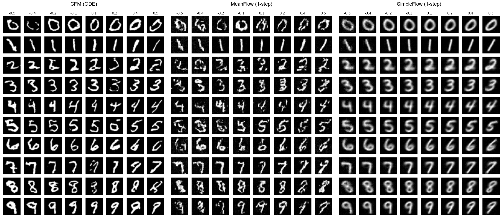

# Conditional Flow Matching and MeanFlow on Morpho-MNIST

This repository contains implementations of conditional generative models trained on the Morpho-MNIST dataset. It supports two methods:
1. **Conditional Flow Matching (CFM)**: A simulation-free continuous normalizing flow method.
2. **MeanFlow**: A method for effective one-step generation using JVP-based loss.
3. **SimpleFlow**: A novel simplified flow method for one-step generation.

The models incorporate two forms of conditioning: discrete digit identity and a continuous slant descriptor extracted from the morphological annotations.

### Inference Results

Comparison between **Conditional Flow Matching (CFM)** (ODE integration), **MeanFlow** (1-step), and **SimpleFlow** (1-step).



## 1. Repository Layout

- `dataset/`: Data loading utilities, including transforms for PIL↔Tensor conversion and a `MorphoMNISTDataset` class that reads the gzipped IDX files and morphological descriptors.
- `model/`: Core model components such as the time-position embedding, transformer backbone.
- `script/train.py`: Training entry point with mixed-precision support and Weights & Biases logging.
- `script/inference.py`: Sampling script demonstrating conditional generation under digit-only, slant-only, and joint conditioning regimes.

## 2. Data Preparation

Place the Morpho-MNIST assets (IDX images/labels and `*-morpho.csv` files) under `dataset/Morpho-MNIST/`. The provided `dataset.dataset.MorphoMNISTDataset` expects filenames following the canonical `train-*`/`t10k-*` naming used by the original release.


## 3. Training

```bash
pip install torch torchvision pandas matplotlib wandb
export WANDB_API_KEY=...         # optional, required for online logging
# Train Conditional Flow Matching (CFM) - Default
python script/train.py --method cfm

# Train MeanFlow (One-step generation)
python script/train.py --method mean_flow

# Train SimpleFlow (One-step generation)
python script/train.py --method simple_flow
```

Some notes:
- Automatic mixed precision is enabled on CUDA devices; disable by forcing `DEVICE=cpu`.
- Weights & Biases logging can be deactivated by setting `WANDB_MODE=offline` or `WANDB_DISABLED=true`.

## 4. Inference and Evaluation

```bash
# Inference with CFM model
python script/inference.py --method cfm

# Inference with MeanFlow model
python script/inference.py --method mean_flow

# Inference with SimpleFlow model
python script/inference.py --method simple_flow
```

The script loads `model.pt`, samples random noise vectors, and performs flow matching generation while conditioning on:

1. All ten digit classes with zero slant.
2. A fixed digit with a sweep across slant values.
3. A two-dimensional grid spanning digits and slants.

## 5. Acknowledgement
The original paper for the Morpho-MNIST dataset: https://arxiv.org/pdf/1809.10780

